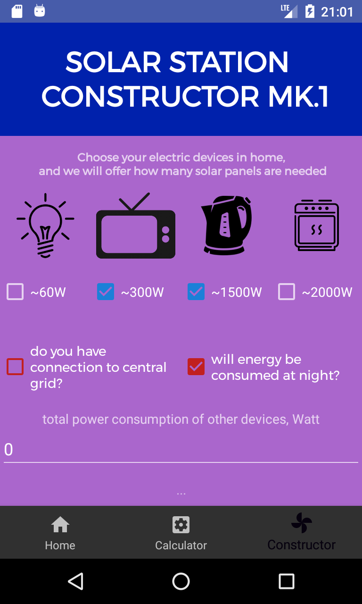
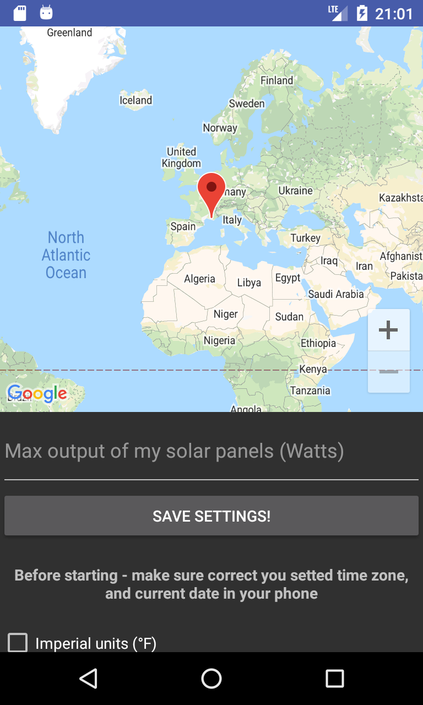

# FireBird-Solar-Forecasting
:satellite: Retrofit, :earth_africa: Google Maps API, :calling: Fragments. Solar panel forecasting app. version 0.2.3

<table style= padding:10px">
  <tr>
    <td>  </td>
      
 <td></td>
 

  </tr>
</table>
